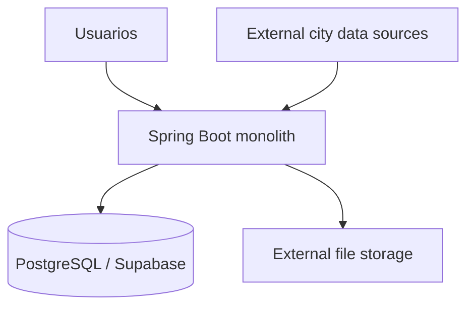
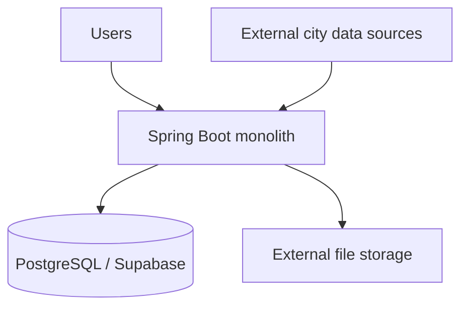

# Arquitectura

## Visión

UrbanPulse se plantea como una plataforma cloud para la gestión inteligente de incidencias urbanas. Su propósito es integrar reportes ciudadanos con datos contextuales de la ciudad para mejorar la clasificación, priorización, seguimiento, análisis y resolución de incidencias.

La incidencia es la entidad central del dominio. Los datos externos no forman un subsistema independiente: enriquecen la incidencia, la vinculan con información urbana y aportan contexto operativo.

## Alcance actual

El proyecto parte de un monolito sencillo con Spring Boot y PostgreSQL/Supabase. La incorporación de nuevos componentes queda condicionada a que exista un problema observable, una hipótesis comprobable y una decisión arquitectónica documentada.

En el código actual existen paquetes para:

| Paquete | Estado actual |
|---|---|
| `controller.rest` | Controladores REST iniciales con métodos vacíos o TODO. |
| `dto` | DTOs y enums del dominio. |
| `entity` | Entidades JPA alineadas con el esquema reducido de Supabase. |
| `mapper` | Mapeadores entre entidades y DTOs. |

No se han encontrado paquetes `service` ni `repository` en el estado revisado.

## Actores

| Actor | Responsabilidad según el documento de introducción |
|---|---|
| Ciudadano | Registra incidencias, aporta ubicación y evidencias, consulta el estado. |
| Operador municipal | Valida, rechaza, clasifica, prioriza y asigna incidencias. |
| Técnico | Acepta trabajos, actualiza progreso y documenta la resolución. |
| Administrador | Gestiona usuarios, roles, categorias, departamentos y fuentes. |
| Analista | Explora indicadores, patrones espaciales y resultados de modelos. |
| Sistema externo | Proporciona datos urbanos, meteorológicos, territoriales o documentales. |

## Componentes

## Pautas de diseño

- La incidencia conserva un ciclo de vida auditable.
- Los datos externos enriquecen la incidencia, pero no bloquean la creación del reporte si una fuente no está disponible.
- Se adopta la solución más sencilla que satisfaga los atributos de calidad medidos.
- Cada cambio relevante debe actualizar el modelo C4, un ADR y las pruebas asociadas.

## Decisiones pendientes

---

# Architecture

## Vision

UrbanPulse is proposed as a cloud platform for intelligent urban incident management. Its purpose is to combine citizen reports with contextual city data to improve incident classification, prioritization, tracking, analysis, and resolution.

The incident is the central domain entity. External data does not form an independent subsystem: it enriches the incident, links it to urban information, and provides operational context.

## Current scope

The project starts as a simple monolith with Spring Boot and PostgreSQL/Supabase. New components should only be added when there is an observable problem, a testable hypothesis, and a documented architectural decision.

The current code contains packages for:

| Package | Current state |
|---|---|
| `controller.rest` | Initial REST controllers with empty methods or TODOs. |
| `dto` | Domain DTOs and enums. |
| `entity` | JPA entities aligned with the reduced Supabase schema. |
| `mapper` | Mappers between entities and DTOs. |

No `service` or `repository` packages were found in the reviewed state.

## Actors

| Actor | Responsibility according to the introduction document |
|---|---|
| Citizen | Registers incidents, provides location and evidence, checks status. |
| Municipal operator | Validates, rejects, classifies, prioritizes, and assigns incidents. |
| Technician | Accepts work, updates progress, and documents resolution. |
| Administrator | Manages users, roles, categories, departments, and sources. |
| Analyst | Explores indicators, spatial patterns, and model results. |
| External system | Provides urban, weather, territorial, or documentary data. |

## Components

## Design guidelines

- The incident preserves an auditable lifecycle.
- External data enriches the incident, but does not block report creation if a source is unavailable.
- The simplest solution that satisfies measured quality attributes is preferred.
- Every relevant change should update the C4 model, an ADR, and the associated tests.

## Pending decisions

